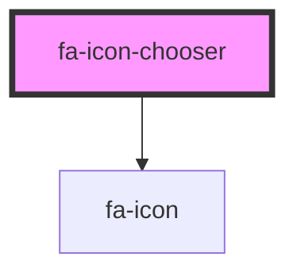

# my-component

<!-- Auto Generated Below -->

## Properties

| Property      | Attribute   | Description                                                                                                  | Type                                 | Default     |
| ------------- | ----------- | ------------------------------------------------------------------------------------------------------------ | ------------------------------------ | ----------- |
| `handleQuery` | --          |                                                                                                              | `(document: string) => Promise<any>` | `undefined` |
| `kitToken`    | `kit-token` | A kit token identifying a kit in which to find icons. Takes precedent over version prop if both are present. | `string`                             | `undefined` |
| `version`     | `version`   | Version to use for finding and loading icons when kitToken is not provided.                                  | `string`                             | `undefined` |

## Events

| Event    | Description | Type                           |
| -------- | ----------- | ------------------------------ |
| `finish` |             | `CustomEvent<Element \| Icon>` |

## Dependencies

### Depends on

- [fa-icon](../fa-icon)

### Graph

----------------------------------------------

*Built with [StencilJS](https://stenciljs.com/)*
