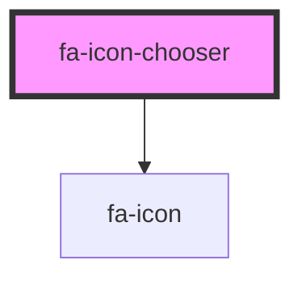

# fa-icon-chooser

<!-- Auto Generated Below -->

## Properties

| Property                 | Attribute                  | Description                                                                                                                                                                                                                                                                                                                                                                                                                                                                                                                                                                                                                                                                                                                                                                                                                                                        | Type                                 | Default     |
| ------------------------ | -------------------------- | ------------------------------------------------------------------------------------------------------------------------------------------------------------------------------------------------------------------------------------------------------------------------------------------------------------------------------------------------------------------------------------------------------------------------------------------------------------------------------------------------------------------------------------------------------------------------------------------------------------------------------------------------------------------------------------------------------------------------------------------------------------------------------------------------------------------------------------------------------------------ | ------------------------------------ | ----------- |
| `getUrlText`             | --                         | Callback function that returns the text body of a response that corresponds to an HTTP GET request for the given URL. For example, it would be the result of [Response.text()](https://developer.mozilla.org/en-US/docs/Web/API/Response/text).                                                                                                                                                                                                                                                                                                                                                                                                                                                                                                                                                                                                                    | `(url: string) => Promise<string>`   | `undefined` |
| `handleQuery`            | --                         | Required callback function which is responsible for taking a given GraphQL query document and returns a Promise that resolves to a JavaScript object corresponding to the body of the associated network request, same as what would be produced by [Response.json()](https://developer.mozilla.org/en-US/docs/Web/API/Response/json). The query document is compliant with the GraphQL API at [api.fontawesome.com](https://fontawesome.com/v5.15/how-to-use/graphql-api/intro/getting-started). The implementation is responsible for handling any authorization that may be necessary to fulfill the request. For example, any time a kit is used to drive the Icon Chooser, it will be necessary to authorize GraphQL API requests sent to api.fontawesome.com with the [`kits_read` scope](https://fontawesome.com/v5.15/how-to-use/graphql-api/auth/scopes). | `(document: string) => Promise<any>` | `undefined` |
| `kitToken`               | `kit-token`                | A kit token identifying a kit in which to find icons. Takes precedent over version prop if both are present.                                                                                                                                                                                                                                                                                                                                                                                                                                                                                                                                                                                                                                                                                                                                                       | `string`                             | `undefined` |
| `searchInputPlaceholder` | `search-input-placeholder` | Placeholder text for search form. Use this to provide translatable text.                                                                                                                                                                                                                                                                                                                                                                                                                                                                                                                                                                                                                                                                                                                                                                                           | `string`                             | `undefined` |
| `version`                | `version`                  | Version to use for finding and loading icons when kitToken is not provided. Must be a valid semantic version, as parsed by the [semver NPM](https://www.npmjs.com/package/semver), like 5.5.13 or 6.0.0-beta1.                                                                                                                                                                                                                                                                                                                                                                                                                                                                                                                                                                                                                                                     | `string`                             | `undefined` |

## Events

| Event    | Description                                                                                                       | Type                      |
| -------- | ----------------------------------------------------------------------------------------------------------------- | ------------------------- |
| `finish` | Clients of the Icon Chooser should listen for this event in order to handle the result of the user's interaction. | `CustomEvent<IconLookup>` |

## Slots

| Slot                                 | Description                                                         |
| ------------------------------------ | ------------------------------------------------------------------- |
| `"brands-style-filter-sr-message"`   | screen reader only message for style filter: brands                 |
| `"duotone-requires-pro"`             | message about requirements for accessing duotone icons              |
| `"duotone-style-filter-sr-message"`  | screen reader only message for style filter: duotone                |
| `"fatal-error-detail"`               | details for fatal error message                                     |
| `"fatal-error-heading"`              | heading for fatal error message                                     |
| `"get-fontawesome-pro"`              | message about getting Font Awesome Pro with link to fontawesome.com |
| `"initial-loading-view-detail"`      | detail for initial loading view                                     |
| `"initial-loading-view-heading"`     | heading for initial loading view                                    |
| `"kit-has-no-uploaded-icons"`        | message about a kit having no icon uploads                          |
| `"light-requires-pro"`               | tooltip for light style requiring Pro                               |
| `"light-style-filter-sr-message"`    | screen reader only message for style filter: light                  |
| `"no-search-results-detail"`         | no seach results message detail                                     |
| `"no-search-results-heading"`        | no search results message heading                                   |
| `"regular-style-filter-sr-message"`  | screen reader only message for style filter: regular                |
| `"search-field-label-free"`          | Search Font Awesome Free Icons                                      |
| `"search-field-label-pro"`           | Search Font Awesome Pro Icons                                       |
| `"search-field-placeholder"`         | search field placeholder                                            |
| `"searching-free"`                   | Searching Free                                                      |
| `"searching-pro"`                    | Searching Pro                                                       |
| `"solid-style-filter-sr-message"`    | screen reader only message for style filter: solid                  |
| `"start-view-detail"`                | detail for message on default view before search                    |
| `"start-view-heading"`               | heading for message on default view before search                   |
| `"suggest-icon-upload"`              | message suggesting to try uploading a custom icon to a kit          |
| `"thin-requires-pro"`                | tooltip for thin style requiring Pro                                |
| `"thin-style-filter-sr-message"`     | screen reader only message for style filter: thin                   |
| `"uploaded-requires-pro"`            | message about requirements for accessing kit icon uploads           |
| `"uploaded-style-filter-sr-message"` | screen reader only message for style filter: uploaded               |

## Dependencies

### Depends on

- [fa-icon](../fa-icon)

### Graph

---

_Built with [StencilJS](https://stenciljs.com/)_
