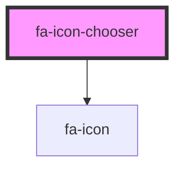

# fa-icon-chooser

<!-- Auto Generated Below -->

## Properties

| Property      | Attribute   | Description                                                                                                                                                                                                                                                                                                                                                                                                                                                                                                                                                                                                                                                                                                                                                                                                                                                          | Type                                 | Default     |
| ------------- | ----------- | -------------------------------------------------------------------------------------------------------------------------------------------------------------------------------------------------------------------------------------------------------------------------------------------------------------------------------------------------------------------------------------------------------------------------------------------------------------------------------------------------------------------------------------------------------------------------------------------------------------------------------------------------------------------------------------------------------------------------------------------------------------------------------------------------------------------------------------------------------------------- | ------------------------------------ | ----------- |
| `getUrlText`  | --          | Callback function that returns the text body of a response that corresponds to an HTTP GET request for the given URL. For example, it would be the result of [Response.text()](https://developer.mozilla.org/en-US/docs/Web/API/Response/text).                                                                                                                                                                                                                                                                                                                                                                                                                                                                                                                                                                                                                      | `(url: string) => Promise<string>`   | `undefined` |
| `handleQuery` | --          | Required callback function which is responsible for taking a given GraphQL query document and returns a Promise that resolves to a JavaScript object corresponding to the body of the associated network request, same as what would be produced by [Response.json()](https://developer.mozilla.org/en-US/docs/Web/API/Response/json).  The query document is compliant with the GraphQL API at [api.fontawesome.com](https://fontawesome.com/v5.15/how-to-use/graphql-api/intro/getting-started).  The implementation is responsible for handling any authorization that may be necessary to fulfill the request. For example, any time a kit is used to drive the Icon Chooser, it will be necessary to authorize GraphQL API requests sent to api.fontawesome.com with the [`kits_read` scope](https://fontawesome.com/v5.15/how-to-use/graphql-api/auth/scopes). | `(document: string) => Promise<any>` | `undefined` |
| `kitToken`    | `kit-token` | A kit token identifying a kit in which to find icons. Takes precedent over version prop if both are present.                                                                                                                                                                                                                                                                                                                                                                                                                                                                                                                                                                                                                                                                                                                                                         | `string`                             | `undefined` |
| `version`     | `version`   | Version to use for finding and loading icons when kitToken is not provided. Must be a valid semantic version, as parsed by the [semver NPM](https://www.npmjs.com/package/semver), like 5.5.13 or 6.0.0-beta1.                                                                                                                                                                                                                                                                                                                                                                                                                                                                                                                                                                                                                                                       | `string`                             | `undefined` |

## Events

| Event    | Description                                                                                                       | Type                           |
| -------- | ----------------------------------------------------------------------------------------------------------------- | ------------------------------ |
| `finish` | Clients of the Icon Chooser should listen for this event in order to handle the result of the user's interaction. | `CustomEvent<Element \| Icon>` |

## Dependencies

### Depends on

- [fa-icon](../fa-icon)

### Graph

----------------------------------------------

*Built with [StencilJS](https://stenciljs.com/)*
