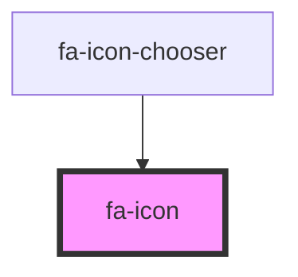

# fa-icon

## CAVEAT: Not For Use Outside this Repo

This `fa-icon` component isn't THE `fa-icon` component. It's just a convenience
component to help with displaying icons within this Icon Chooser. It's API
may change as suits the needs of the Icon Chooser.

<!-- Auto Generated Below -->

## Overview

This fa-icon component isn't THE fa-icon component. It's just a convenience
component to help with displaying icons within the Icon Chooser.

## Properties

| Property                 | Attribute                   | Description | Type                                                                                                   | Default     |
| ------------------------ | --------------------------- | ----------- | ------------------------------------------------------------------------------------------------------ | ----------- |
| `class`                  | `class`                     |             | `string`                                                                                               | `undefined` |
| `emitIconDefinition`     | `emit-icon-definition`      |             | `(iconDefinition: IconDefinition) => void`                                                             | `undefined` |
| `familyStylePathSegment` | `family-style-path-segment` |             | `string`                                                                                               | `undefined` |
| `getUrlText`             | `get-url-text`              |             | `(url: string) => Promise<string>`                                                                     | `undefined` |
| `icon`                   | `icon`                      |             | `IconDefinition`                                                                                       | `undefined` |
| `iconUpload`             | `icon-upload`               |             | `{ name: string; unicode: number; version: number; width: string; height: string; pathData: string; }` | `undefined` |
| `kitToken`               | `kit-token`                 |             | `string`                                                                                               | `undefined` |
| `name`                   | `name`                      |             | `string`                                                                                               | `undefined` |
| `pro`                    | `pro`                       |             | `boolean`                                                                                              | `false`     |
| `size`                   | `size`                      |             | `string`                                                                                               | `undefined` |
| `stylePrefix`            | `style-prefix`              |             | `string`                                                                                               | `undefined` |
| `svgApi`                 | `svg-api`                   |             | `any`                                                                                                  | `undefined` |
| `svgFetchBaseUrl`        | `svg-fetch-base-url`        |             | `string`                                                                                               | `undefined` |

## Dependencies

### Used by

- [fa-icon-chooser](../fa-icon-chooser)

### Graph

---

_Built with [StencilJS](https://stenciljs.com/)_
